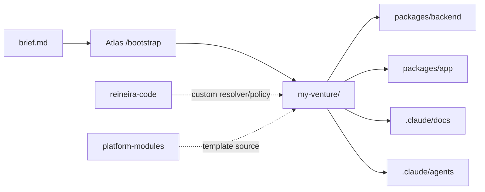

# Reineira Atlas

[](https://reineira.xyz)
[](LICENSE)
[](https://claude.com/claude-code)

> **From a one-page brief to a deployed venture in 1 hour.**
> Atlas scaffolds a production-ready dApp on Arbitrum — frontend, backend, smart wallets, and confidential settlement — then 12 AI agents help you ship it.

**Time budget:** 20 min workspace + accounts · 25 min `/bootstrap` · 15 min env + deploy. Assumes a one-page brief ready and a ZeroDev project ID in hand.

> **Platform compatibility:** Atlas declares `platform: "0.1"` in `reineira.json`. When ReineiraOS bumps to 0.2 (breaking contract interface changes), Atlas updates in lockstep — check the [CHANGELOG](./CHANGELOG.md) before upgrading an existing venture.

---

## What you ship

Run `/bootstrap` against a one-page brief. Atlas reads your brief, queries the MCP server for live contract addresses, clones `platform-modules` into a fresh venture directory, fills strategy docs from your brief, and configures 12 agents tuned to your venture's stage.

```
my-venture/
├── packages/backend/        ← TypeScript API, Vercel-ready, Clean Architecture
├── packages/app/            ← React 19 + Vite + ZeroDev smart wallets
├── packages/contracts/      ← Custom resolver + policy stubs (via reineira-code)
└── .claude/
    ├── docs/                ← Strategy, architecture, metrics — pre-filled from brief
    ├── agents/              ← 12 AI agents tuned to venture stage
    └── data/                ← Append-only decision log + KPI tracking
```

Every venture inherits Reineira's primitives without writing them:

- **Confidential settlement** — Fhenix CoFHE-encrypted escrows on Arbitrum
- **Pluggable insurance** — LP-backed coverage pools with FHE risk pricing
- **Cross-chain liquidity** — CCTP V2 USDC routing
- **Smart wallets** — ZeroDev gasless transactions, passkey auth
- **Operator network** — stake-weighted relay (testnet today)

---

## Examples

Working ventures bootstrapped with Atlas — full repos you can read, fork, and run.

[github.com/ReineiraOS/examples](https://github.com/ReineiraOS/examples)

---

## Is this for you?

**Atlas is for you if** you're building...

- ...a settlement-heavy product — P2P, escrow, marketplaces, lending, insurance
- ...something that needs confidentiality — B2B flows, regulated payments, agent commerce
- ...on Arbitrum and want a working stack day one, not weeks of plumbing

**Skip Atlas if** you...

- ...just want a chain (use Conduit / AltLayer for plain Orbit deployment)
- ...don't need FHE settlement (Atlas's value is the Reineira primitives)
- ...want a no-code product (Atlas requires Claude Code and comfort with config)

---

## The builder journey

Three repos, one pipeline. Atlas orchestrates the flow.

```
brief.md  →  /bootstrap  →  reineira-code  →  /integrate  →  Ship
                Atlas        Build contracts     Atlas         Vercel + Arbitrum
```

1. **Plan.** Clone Atlas, write `brief.md` — venture, problem, entities, fee model, stage.
2. **Bootstrap.** Run `/bootstrap` inside Atlas. Generates the startup OS _and_ scaffolds the app from `platform-modules`. One command, full stack.
3. **Build on-chain logic.** Clone `reineira-code`. Describe the Gate or Policy in plain English; Claude generates Solidity + tests + deploy script. Ship to Arbitrum Sepolia.
4. **Integrate.** Back in Atlas, run `/integrate`. Wires the deployed contract into your scaffolded backend and frontend — SDK, webhooks, UI flows.
5. **Iterate.** Run `/strategy`, `/pitch-prep`, `/weekly-plan` as you grow. The agent team grows with the venture.

Full walkthrough: [docs.reineira.xyz/developer-tools/builder-journey](https://docs.reineira.xyz/developer-tools/builder-journey)

---

## Quick start

### 1. Workspace

Clone Atlas alongside platform-modules. They must be siblings — Atlas reads from `../platform-modules/`.

```bash
mkdir my-workspace && cd my-workspace
git clone https://github.com/ReineiraOS/reineira-atlas.git
git clone https://github.com/ReineiraOS/platform-modules.git
```

### 2. Brief

```bash
cd reineira-atlas
cp brief.template.md brief.md
# Edit brief.md — venture name, problem, entities, fee model, stage
```

See `test-briefs/` for worked examples — `invoice-shield.md`, `peer-swap.md`, `trade-guard.md`, `agrilend.md`, `blindference.md`, `freightvault.md`.

### 3. Service accounts

| Service | What for | Required? |
| --- | --- | --- |
| [ZeroDev](https://dashboard.zerodev.app) | Smart wallets, passkeys, gas sponsorship | **Yes** |
| [Vercel](https://vercel.com) | Backend + frontend deploy | For deploy only |
| [Neon](https://neon.tech) | Postgres database | For deploy only |
| [QuickNode](https://www.quicknode.com) | Blockchain webhooks | When wiring escrow events |
| [Reclaim Protocol](https://reclaimprotocol.org) | zkTLS proofs (delivery, payment) | If using off-chain conditions |

### 4. Bootstrap

Open `reineira-atlas/` in Claude Code, then:

```
/bootstrap
```

A new `../my-venture/` directory appears.

### 5. Run and deploy

```bash
cd ../my-venture
pnpm install
pnpm dev:backend    # http://localhost:3000
pnpm dev:app        # http://localhost:4831

# When ready
vercel --prod
```

The backend uses Vercel serverless functions (`api/` directory) — no long-running server in production.

---

## Common workflows

Atlas is composable. Call it in pieces, not always at full strength.

| Command | Use when |
| --- | --- |
| `/bootstrap` | First-time setup — generate OS + app |
| `/bootstrap os` | Re-generate strategy docs + agents only (keep existing app) |
| `/bootstrap dev` | Re-generate the app scaffold only (keep existing docs) |
| `/bootstrap entity Invoice` | Add a new data entity to an existing venture |
| `/bootstrap test-briefs/invoice-shield.md` | Try Atlas on a worked example before writing your own brief |

---

## Reineira capabilities

Atlas is the launcher. Reineira is what the launched venture inherits.

### Settlement engine

- **ConfidentialEscrow** — FHE-encrypted holdbacks. Amount, parties, and terms stay private; conditions resolve in ciphertext.
- **IConditionResolver** — pluggable release logic. Plug in zkTLS (Reclaim), oracles (Chainlink), multi-sig, or time locks.
- **Virtual escrows** — condition-first, funds-on-demand. Settlement pulls L2 liquidity when the trigger fires.

### Coverage layer

- **CoverageManager** — buy insurance against counterparty or model failure. LP-backed pools price risk in FHE.
- **IUnderwriterPolicy** — pluggable risk + dispute logic. Premium is encrypted; disputes resolve via `judge()`.
- **PoolFactory** — anyone can spin up a coverage pool with their own policy and risk parameters.

### Infrastructure

- **Operator network** — stake-weighted CCTP V2 relay. Operators earn 0.5% of bridged volume; slashed on failed or censored transfers.
- **Cross-chain** — bridge-agnostic plugin interface. CCTP V2 today; LayerZero OFT scoped.
- **Smart wallets** — ZeroDev ERC-4337, passkey auth, gasless onboarding.

> **Live contract addresses:** query the MCP server (`mcp__reineira__get_contracts`) or see [reineira.xyz/docs/reference/contracts](https://reineira.xyz/docs/reference/contracts). **Never hardcode.**

---

## The ecosystem

Three repos. Each does one job. All declare the same platform version.

| Repo | Stack | Job | Platform |
| --- | --- | --- | --- |
| **reineira-atlas** _(this repo)_ | Markdown + Claude Code agents | Plan the venture, scaffold the app | 0.1 |
| **[reineira-code](https://github.com/ReineiraOS/reineira-code)** | Hardhat + Solidity + cofhejs | Build on-chain plugins (Gates, Policies) | 0.1 |
| **[platform-modules](https://github.com/ReineiraOS/platform-modules)** | pnpm monorepo · TypeScript + React 19 | Ship the product (backend + frontend) | 0.1 |



<details>
<summary><strong>The 12 agents</strong> — what bootstrap generates inside <code>.claude/agents/</code></summary>

| Category | Agents | Example commands |
| --- | --- | --- |
| **Protocol** | `protocol-resolver`, `protocol-integration` | `/resolver`, `/integrate` |
| **Product** | `product-frontend`, `product-backend` | `/dev-frontend`, `/dev-backend` |
| **Strategy** | `strategy-business`, `strategy-tokenomics`, `strategy-pitch` | `/strategy`, `/tokenomics`, `/pitch-prep` |
| **Growth** | `growth-community`, `growth-content` | `/community`, `/content` |
| **Research** | `research-metrics` | `/strategy` (with citations) |
| **Legal** | `legal-compliance` | `/compliance` |
| **Ops** | `core-chief` | `/weekly-plan` |

Each agent reads from `.claude/docs/` and writes to `.claude/data/`. See `.claude/agents/_dispatch.md` for routing.

</details>

---

## Slash commands

### Protocol

| Command | What it does |
| --- | --- |
| `/resolver` | Design a condition resolver for escrow release |
| `/policy` | Design an insurance underwriter policy |
| `/integrate` | Wire the protocol end-to-end — contract → SDK → frontend → backend |

### Product

| Command | What it does |
| --- | --- |
| `/dev-frontend` | Frontend development on React 19 + ZeroDev |
| `/dev-backend` | Backend development on TypeScript Clean Architecture |

### Strategy and ops

| Command | What it does |
| --- | --- |
| `/strategy` | Strategic analysis grounded in your METRICS dashboard |
| `/tokenomics` | Incentive design and fee structure |
| `/pitch-prep` | Investor materials, fund intro |
| `/content` | Tutorials, blogs, social threads |
| `/community` | Developer relations, first 100 users |
| `/compliance` | Crypto regulatory review — MiCA, AML/KYC |
| `/weekly-plan` | Sprint review and planning |

---

## What's not yet shipped

Honest about works-today vs. planned. Treat as the live roadmap.

### In progress

- **Arbitrum L3 / Orbit deployment.** Atlas today scaffolds for Arbitrum L2 only. The Arbitrum London Buildathon adds dedicated-L3-per-venture with virtual escrow routing from L2 pools, customizable challenge period, and optional fast withdrawals.
- **Mobile module.** `platform-modules/` ships `app` (web) and `backend` today. React Native + ZeroDev mobile module planned for Q3 2026.
- **Mainnet contracts.** All deployments on Arbitrum Sepolia. Mainnet ships with the Q4 2026 audit.

### Referenced in docs, not yet live

- MCP server for live contract address queries (`mcp__reineira__get_contracts`)
- Operator network beyond testnet relayers
- End-to-end insurance pool example in `test-briefs/`

### Future

- **Encrypted main-net on Fhenix CoFHE** — Q4 2026
- **REINEIRA token launch (TGE)** — Q3 2026
- **Inter-rollup bridges beyond CCTP V2** — LayerZero OFT path scoped

---

## Compatibility

| Requirement | Version | Notes |
| --- | --- | --- |
| Platform | ReineiraOS 0.1 | Declared in `reineira.json` |
| Claude Code | Latest | `npm i -g @anthropic-ai/claude-code` |
| Node.js | 20+ | All three repos |
| pnpm | 10+ | `platform-modules` workspace |
| npm | Any | Atlas + Code |
| platform-modules | Sibling directory | `../platform-modules/` |
| Funded wallet | — | Private key for Arbitrum Sepolia deploys |

---

## Help and community

- **Telegram:** [@BrushesAndBytes](https://t.me/BrushesAndBytes) — direct line to Alexander, founder
- **Docs:** [docs.reineira.xyz](https://docs.reineira.xyz)

---

## Contributing

See [CONTRIBUTING.md](./CONTRIBUTING.md). Bug reports, brief examples, and skill contributions are welcome. Sign the [CLA](./CLA.md) for code contributions.

---

## License

[MPL-2.0](./LICENSE) — Mozilla Public License 2.0. Atlas is the builder-platform / curation layer; file-level copyleft keeps modifications to Atlas source shared while permitting combination with proprietary code.
